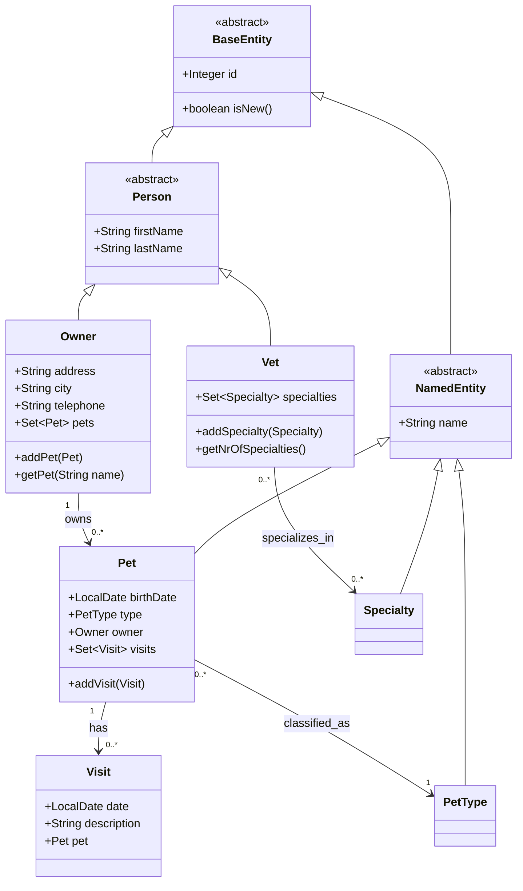

# Application Specification (Reverse-Engineered)
**Veterinary Clinic Management System - Legacy Spring MVC Implementation**

*Generated for modernization to Spring Boot 3 + Next.js architecture*  
*Date: October 31, 2025*

---

## 1. Domain Model

### Entity Hierarchy

### Entity Specifications

| Entity | Table | Key Fields | Constraints | Relationships |
|--------|--------|------------|-------------|---------------|
| **Owner** | `owners` | firstName, lastName, address, city, telephone | All fields @NotEmpty; telephone @Digits(max=10) | 1:N with Pet |
| **Pet** | `pets` | name, birthDate, type, owner | name @NotEmpty; type required | N:1 with Owner, 1:N with Visit, N:1 with PetType |
| **Visit** | `visits` | date, description, pet | description @NotEmpty; date defaults to today | N:1 with Pet |
| **Vet** | `vets` | firstName, lastName, specialties | Inherits Person validations | M:N with Specialty |
| **Specialty** | `specialties` | name | name @NotEmpty | M:N with Vet |
| **PetType** | `types` | name | name @NotEmpty | 1:N with Pet |

### Business Invariants

| Rule | Description | Code Location | Migration Impact |
|------|-------------|---------------|------------------|
| **Unique Pet Names per Owner** | Pet names must be unique within owner's collection | `Owner.getPet()`, `PetController.processCreationForm()` | Preserve in Next.js validation |
| **Required Contact Info** | All owner contact fields mandatory | `Owner` entity validations | Map to TypeScript interfaces |
| **Pet Type Classification** | Every pet must have a type | `Pet.type` @ManyToOne required | Dropdown in Next.js forms |
| **Visit Description Required** | All visits must have clinical notes | `Visit.description` @NotEmpty | React form validation |
| **Chronological Visit Ordering** | Visits sorted by date (newest first) | `Pet.getVisits()` property sorting | Sort in Next.js components |

---

## 2. Use-Case Catalogue

### Owner Management

| Use Case | Preconditions | Trigger | Process | Postconditions |
|----------|---------------|---------|---------|----------------|
| **Register New Owner** | None | GET `/owners/new` | Display empty form → validate → save | Owner created with unique ID |
| **Search Owners** | None | GET `/owners/find` | Enter criteria → search → display results | Owner list or single redirect |
| **Update Owner Profile** | Owner exists | GET `/owners/{id}/edit` | Load form → validate → save | Owner data updated |
| **View Owner Details** | Owner exists | GET `/owners/{id}` | Load owner + pets + visits | Complete owner profile displayed |

### Pet Management

| Use Case | Preconditions | Trigger | Process | Postconditions |
|----------|---------------|---------|---------|----------------|
| **Register Pet** | Owner exists | GET `/owners/{ownerId}/pets/new` | Select type → validate name → save | Pet added to owner |
| **Update Pet Info** | Pet exists | GET `/owners/{ownerId}/pets/{petId}/edit` | Load form → validate → save | Pet data updated |
| **View Pet History** | Pet exists | Implicit in owner details | Load pet + visits | Medical history displayed |

### Veterinary Operations

| Use Case | Preconditions | Trigger | Process | Postconditions |
|----------|---------------|---------|---------|----------------|
| **Record Visit** | Pet exists | GET `/owners/{ownerId}/pets/{petId}/visits/new` | Enter notes → save | Visit added to pet history |
| **View Visit History** | Pet exists | GET `/owners/*/pets/{petId}/visits` | Load all visits | Chronological visit list |
| **List Veterinarians** | None | GET `/vets` | Load all vets + specialties | Vet directory displayed |

### Data Export

| Use Case | Preconditions | Trigger | Process | Postconditions |
|----------|---------------|---------|---------|----------------|
| **Export Vet Data (JSON)** | None | GET `/vets.json` | Serialize to JSON | JSON response returned |
| **Export Vet Data (XML)** | None | GET `/vets.xml` | JAXB marshalling | XML response returned |

---

## 3. Controller/API Inventory

### OwnerController

| Endpoint | Method | Parameters | Model Attributes | View/Response | Migration Target |
|----------|--------|------------|------------------|---------------|------------------|
| `/owners/new` | GET | - | `owner` (empty) | `owners/createOrUpdateOwnerForm` | Next.js form component |
| `/owners/new` | POST | `@Valid Owner` | - | Redirect or form with errors | REST POST `/api/owners` |
| `/owners/find` | GET | - | `owner` (empty) | `owners/findOwners` | Next.js search component |
| `/owners` | GET | `Owner` (search criteria) | `selections` | `owners/ownersList` or redirect | REST GET `/api/owners?search=` |
| `/owners/{id}` | GET | `@PathVariable id` | `owner` (loaded) | `owners/ownerDetails` | REST GET `/api/owners/{id}` |
| `/owners/{id}/edit` | GET | `@PathVariable id` | `owner` (loaded) | `owners/createOrUpdateOwnerForm` | Next.js edit component |
| `/owners/{id}/edit` | POST | `@Valid Owner`, `@PathVariable id` | - | Redirect or form with errors | REST PUT `/api/owners/{id}` |

### PetController

| Endpoint | Method | Parameters | Model Attributes | View/Response | Migration Target |
|----------|--------|------------|------------------|---------------|------------------|
| `/owners/{ownerId}/pets/new` | GET | `@PathVariable ownerId` | `pet`, `types`, `owner` | `pets/createOrUpdatePetForm` | Next.js pet form |
| `/owners/{ownerId}/pets/new` | POST | `@Valid Pet`, `@PathVariable ownerId` | - | Redirect or form with errors | REST POST `/api/pets` |
| `/owners/{ownerId}/pets/{petId}/edit` | GET | `@PathVariable ownerId`, `@PathVariable petId` | `pet`, `types`, `owner` | `pets/createOrUpdatePetForm` | Next.js edit form |
| `/owners/{ownerId}/pets/{petId}/edit` | POST | `@Valid Pet`, path variables | - | Redirect or form with errors | REST PUT `/api/pets/{petId}` |

### VisitController

| Endpoint | Method | Parameters | Model Attributes | View/Response | Migration Target |
|----------|--------|------------|------------------|---------------|------------------|
| `/owners/*/pets/{petId}/visits/new` | GET | `@PathVariable petId` | `visit` (pre-loaded) | `pets/createOrUpdateVisitForm` | Next.js visit form |
| `/owners/{ownerId}/pets/{petId}/visits/new` | POST | `@Valid Visit`, path variables | - | Redirect or form with errors | REST POST `/api/visits` |
| `/owners/*/pets/{petId}/visits` | GET | `@PathVariable petId` | `visits` | `visitList` | REST GET `/api/pets/{petId}/visits` |

### VetController

| Endpoint | Method | Parameters | Model Attributes | View/Response | Migration Target |
|----------|--------|------------|------------------|---------------|------------------|
| `/vets` | GET | - | `vets` | `vets/vetList` | Next.js component |
| `/vets.json` | GET | - | - | JSON response | REST GET `/api/vets` |
| `/vets.xml` | GET | - | - | XML response | Keep for backward compatibility |

### Error Handling

| Controller | Error Type | Current Behavior | Migration Strategy |
|------------|------------|------------------|-------------------|
| All | Validation Errors | Return form with `BindingResult` | JSON error responses + React error states |
| All | Entity Not Found | Spring MVC exception handling | HTTP 404 with error JSON |
| All | General Exceptions | Default error page | Next.js error boundaries |

---

## 4. Service Contracts

### ClinicService Interface

| Method | Parameters | Return Type | Transaction | Caching | Side Effects |
|--------|------------|-------------|-------------|---------|--------------|
| `findPetTypes()` | - | `Collection<PetType>` | `@Transactional(readOnly=true)` | None | None |
| `findOwnerById(int)` | `id: int` | `Owner` | `@Transactional(readOnly=true)` | None | May throw if not found |
| `findPetById(int)` | `id: int` | `Pet` | `@Transactional(readOnly=true)` | None | May throw if not found |
| `findOwnerByLastName(String)` | `lastName: String` | `Collection<Owner>` | `@Transactional(readOnly=true)` | None | Empty string returns all |
| `findVets()` | - | `Collection<Vet>` | `@Transactional(readOnly=true)` | `@Cacheable("vets")` | None |
| `findVisitsByPetId(int)` | `petId: int` | `Collection<Visit>` | **Missing @Transactional** | None | None |
| `saveOwner(Owner)` | `owner: Owner` | `void` | `@Transactional` | None | Insert/update based on ID |
| `savePet(Pet)` | `pet: Pet` | `void` | `@Transactional` | None | Insert/update + owner relationship |
| `saveVisit(Visit)` | `visit: Visit` | `void` | `@Transactional` | None | Insert/update + pet relationship |

### Service Implementation Notes

| Aspect | Current Implementation | Spring Boot Migration |
|--------|----------------------|----------------------|
| **Transaction Management** | XML-configured `@Transactional` | Preserve with `@EnableTransactionManagement` |
| **Caching** | XML-configured cache manager | Migrate to `@EnableCaching` + Redis/Caffeine |
| **Repository Injection** | Constructor-based DI | Keep constructor injection |
| **Exception Handling** | Repository exceptions bubble up | Add service-level exception mapping |

### Repository Layer

| Repository | Key Methods | Current Profile Support | Migration Strategy |
|------------|-------------|-------------------------|-------------------|
| **OwnerRepository** | `findById`, `findByLastName`, `save` | JPA, JDBC, Spring Data JPA | Standardize on Spring Data JPA |
| **PetRepository** | `findById`, `save`, `findPetTypes` | JPA, JDBC, Spring Data JPA | Standardize on Spring Data JPA |
| **VetRepository** | `findAll` | JPA, JDBC, Spring Data JPA | Standardize on Spring Data JPA |
| **VisitRepository** | `save`, `findByPetId` | JPA, JDBC, Spring Data JPA | Standardize on Spring Data JPA |

---

## 5. Non-Functional Requirements

### Security

| Aspect | Current Implementation | Migration Requirements |
|--------|----------------------|----------------------|
| **Authentication** | None (open application) | Consider adding OAuth2/JWT for API access |
| **Authorization** | None | Add role-based access if needed |
| **Input Validation** | JSR-303 Bean Validation | Preserve server-side + add client-side |
| **Mass Assignment Protection** | `@InitBinder` disables ID binding | Map to DTO pattern in REST APIs |
| **XSS Prevention** | JSP escaping | React XSS protection + CSP headers |

### Performance

| Aspect | Current Implementation | Migration Strategy |
|--------|----------------------|-------------------|
| **Database Access** | 3 persistence profiles (JPA/JDBC/Spring Data) | Standardize on Spring Data JPA |
| **Connection Pooling** | HikariCP via Spring Boot | Keep HikariCP configuration |
| **Caching** | Spring Cache (`@Cacheable` on vets) | Enhance with Redis for distributed caching |
| **Lazy Loading** | JPA relationships | Review N+1 query patterns |
| **Pagination** | Not implemented | Add to search operations in REST API |

### Data Management

| Aspect | Current Implementation | Migration Requirements |
|--------|----------------------|----------------------|
| **Database Support** | H2, MySQL, PostgreSQL via profiles | Keep multi-DB support via Spring Boot profiles |
| **Schema Management** | SQL scripts in resources | Add Flyway/Liquibase for migrations |
| **Data Validation** | Bean Validation annotations | Preserve + add TypeScript interfaces |
| **Audit Trail** | None | Consider adding created/modified timestamps |

### Error Handling

| Layer | Current Approach | Migration Strategy |
|-------|------------------|-------------------|
| **Web Layer** | Spring MVC error pages | JSON error responses + React error boundaries |
| **Service Layer** | Exception propagation | Add service-level exception mapping |
| **Repository Layer** | Spring Data exceptions | Preserve DataAccessException hierarchy |
| **Validation** | BindingResult in controllers | JSON validation error responses |

### Configuration

| Aspect | Current Implementation | Migration Target |
|--------|----------------------|------------------|
| **Application Config** | XML files (5 files) | `application.yml` + `@Configuration` classes |
| **View Resolution** | XML-configured JSP/XML views | Remove JSP, keep XML for backward compatibility |
| **Component Scanning** | XML `<context:component-scan>` | `@ComponentScan` annotations |
| **Property Management** | XML property placeholder | Spring Boot externalized configuration |

### Deployment

| Aspect | Current Implementation | Migration Target |
|--------|----------------------|------------------|
| **Packaging** | WAR for external container | JAR with embedded Tomcat |
| **Container Support** | Jetty 11+, Tomcat 10+ | Embedded Tomcat via Spring Boot |
| **Profile Management** | Spring profiles for DB selection | Spring Boot profiles |
| **Static Resources** | WebJars + traditional web resources | Next.js static asset pipeline |

---

## 6. Traceability Map (Code → Spec)

### Domain Model Mapping

| Specification Element | Code Location | Migration Note |
|-----------------------|---------------|----------------|
| **Entity Hierarchy** | `src/main/java/org/springframework/samples/petclinic/model/` | Convert to TypeScript interfaces for frontend |
| **BaseEntity Pattern** | `BaseEntity.java`, `NamedEntity.java`, `Person.java` | Preserve JPA annotations, add DTO layer |
| **Relationship Mappings** | JPA annotations in entity classes | Review fetch strategies for performance |
| **Business Invariants** | Validation annotations + custom logic | Map to both server/client validation |

### Controller Layer Mapping

| Current Controller | Code Location | REST API Target |
|-------------------|---------------|-----------------|
| **OwnerController** | `src/main/java/org/springframework/samples/petclinic/web/OwnerController.java` | `/api/v1/owners` endpoints |
| **PetController** | `src/main/java/org/springframework/samples/petclinic/web/PetController.java` | `/api/v1/pets` endpoints |
| **VisitController** | `src/main/java/org/springframework/samples/petclinic/web/VisitController.java` | `/api/v1/visits` endpoints |
| **VetController** | `src/main/java/org/springframework/samples/petclinic/web/VetController.java` | `/api/v1/vets` endpoints |

### Service Layer Mapping

| Service Contract | Code Location | Preservation Strategy |
|------------------|---------------|----------------------|
| **ClinicService Interface** | `src/main/java/org/springframework/samples/petclinic/service/ClinicService.java` | Keep interface, enhance implementation |
| **ClinicServiceImpl** | `src/main/java/org/springframework/samples/petclinic/service/ClinicServiceImpl.java` | Add missing `@Transactional` annotations |
| **Transaction Configuration** | `src/main/resources/spring/business-config.xml` | Convert to `@EnableTransactionManagement` |
| **Caching Configuration** | `@Cacheable` annotations + XML config | Migrate to Spring Boot cache auto-configuration |

### Configuration Migration Map

| Current XML Config | Code Location | Spring Boot Target |
|-------------------|---------------|-------------------|
| **Business Config** | `src/main/resources/spring/business-config.xml` | `@Configuration` classes + `application.yml` |
| **MVC Config** | `src/main/resources/spring/mvc-core-config.xml` | `@EnableWebMvc` + auto-configuration |
| **View Config** | `src/main/resources/spring/mvc-view-config.xml` | Remove (Next.js handles views) |
| **DataSource Config** | `src/main/resources/spring/datasource-config.xml` | Spring Boot DataSource auto-configuration |
| **Tools Config** | `src/main/resources/spring/tools-config.xml` | Spring Boot DevTools |

### View Layer Migration

| Current JSP Views | Code Location | Next.js Target |
|------------------|---------------|----------------|
| **Owner Views** | `src/main/webapp/WEB-INF/jsp/owners/` | React components in `/components/owners/` |
| **Pet Views** | `src/main/webapp/WEB-INF/jsp/pets/` | React components in `/components/pets/` |
| **Vet Views** | `src/main/webapp/WEB-INF/jsp/vets/` | React components in `/components/vets/` |
| **Custom Tags** | `src/main/webapp/WEB-INF/tags/` | Reusable React components |
| **Static Resources** | `src/main/webapp/resources/` | Next.js public directory + CSS modules |

### Database Layer Mapping

| Current Repository | Code Location | Spring Boot Target |
|-------------------|---------------|--------------------|
| **Repository Interfaces** | `src/main/java/org/springframework/samples/petclinic/repository/` | Enhance with Spring Data JPA |
| **JPA Implementation** | `src/main/java/org/springframework/samples/petclinic/repository/jpa/` | Remove (Spring Data auto-implementation) |
| **JDBC Implementation** | `src/main/java/org/springframework/samples/petclinic/repository/jdbc/` | Remove or keep as alternative |
| **Database Scripts** | `src/main/resources/db/` | Migrate to Flyway migrations |

---

## Migration Risk Assessment

### High Priority (Phase 1)

| Risk | Impact | Code Location | Mitigation |
|------|--------|---------------|------------|
| **XML → JavaConfig** | 🔴 Breaking | All `src/main/resources/spring/*.xml` | Incremental conversion with dual support |
| **JSP Form Binding** | 🔴 Breaking | All controller `@ModelAttribute` usage | Create DTO layer for API contracts |
| **View Technology** | 🔴 Breaking | All JSP files in `WEB-INF/jsp/` | Parallel Next.js development |

### Medium Priority (Phase 2)

| Risk | Impact | Code Location | Mitigation |
|------|--------|---------------|------------|
| **Transaction Boundaries** | 🟡 Performance | `ClinicServiceImpl.findVisitsByPetId()` | Add missing `@Transactional` |
| **Caching Strategy** | 🟡 Performance | XML cache configuration | Migrate to Spring Boot + Redis |
| **Error Handling** | 🟡 UX | Controller exception handling | Implement global exception handlers |

### Low Priority (Phase 3)

| Risk | Impact | Code Location | Mitigation |
|------|--------|---------------|------------|
| **Static Resources** | 🟢 Cosmetic | WebJars + CSS files | Next.js asset pipeline |
| **Content Negotiation** | 🟢 API | XML marshalling support | Keep for backward compatibility |
| **Database Profiles** | 🟢 Deployment | Multi-database support | Preserve via Spring Boot profiles |

---

**Document Status**: Ready for Phase 1 Migration (XML → JavaConfig + Spring Boot)  
**Next Steps**: Begin backend API development while preserving JSP views for parallel migration  
**Success Criteria**: Zero behavioral changes, improved performance, modern development experience
